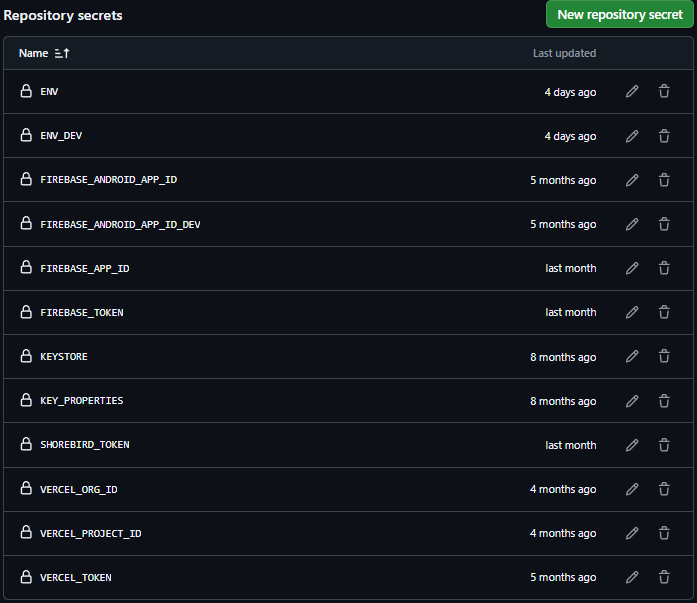

# Anilist
Anilist is a simple and delightful app for anime fans. Whether you're organizing your favorite anime, finding something new to watch, or just browsing trailers, Anilist helps make your anime experience more fun and seamless.

The app offers several handy features to enhance your daily anime browsing. You can discover new anime instantly with the Random Anime feature, search anime titles easily using speech-to-text Voice Search & enjoy a comfortable night viewing with the built-in Dark Mode. Anilist also supports multiple languages, making it accessible for anime fans across the world.

Anilist is built with Flutter using the Bloc pattern and integrates various Firebase services for core functionality, such as authentication, firestore, remote config, etc. Meanwhile, local storage is handled with SQFLite and Shared Preferences. Anilist is also integrated with various 3rd party service such as Jikan Moe API for anime list & shorebird for  code push.
 
## Tech Stack
- [Flutter](https://flutter.dev/)
  - Local Storage (SQFLite & Shared Preferences)
  - Flutter Bloc
  - Dio
  - App Links

- [Firebase](https://firebase.google.com/)
  - Authentication
  - Firestore
  - Crashlytics
  - Messaging
  - Remote Config
  - App Distribution
  - Hosting

## Tools
- [GitHub](https://github.com/) - Version Control System
- [GitHub Actions](https://github.com/features/actions) - CI/CD
- [Jira](https://lowpriority.atlassian.net) - Project Management  
  ↳ [Dashboard](https://lowpriority.atlassian.net/jira/dashboards/10003)
- [Postman](https://www.postman.com/) - API Documentation  
  ↳ [Collection](https://www.postman.com/resdev-3827892/anilist/collection/aphktk6/jikan-moe?action=share&creator=44337202)


## Third-Party Integrations
- [Jikan Moe API](https://jikan.moe/)
- [Shorebird](https://shorebird.dev/)
- [Google AdMob](https://admob.google.com/)

## Development Guide

> [!IMPORTANT]
> This project is available for personal use and contributions through pull requests. Commercial use of this project is strictly prohibited. Please read [LICENSE](LICENSE.md) for more details.

### Requirement
- [Flutter SDK v3.24.3 stable](https://docs.flutter.dev/get-started/install)
- [Firebase Project](https://console.firebase.google.com/)  
   ℹ️ This project uses **two** **Firebase** projects, **prod** and **dev**. If you don't plan to publish the project, it's fine to set up **one** **Firebase** project, which we'll consider as the dev environment in this guide.
- [Firebase CLI](https://firebase.google.com/docs/cli)
- (Optional) [Shorebird](https://console.shorebird.dev/)

### Step

1. #### Clone or Fork the Repository
    ```sh
    git clone https://github.com/devresaja/anilist.git
    ```

2. #### Get all dependencies
    ```sh
    flutter pub get
    ```
    
3. #### Integrate the **Firebase project** using **[FlutterFire CLI](https://firebase.flutter.dev/docs/cli/)**
   ℹ️ Add **.dev** at the end of the package name when integrating the Firebase project for the dev environment.  
    Example: 
    ```
    com.anilist.android.dev
    ```  

4. #### Set up env
    4.1. In the root project directory, create .env and or .env.dev files depending on your firebase project.

    4.2. Open [.env.dev](.env.dev) and fill the file with code below. You will find those value at [firebase_options.dart](firebase_options.dart). Also do the same at [.env](.env).
      ```
      firebaseApiKey='AIzaSyCUxxxxxxxxxxxxx'
      firebaseAppId='1:8xxxxxxx6166:android:264acxxxxxxxxxxd7'
      firebaseMessagingSenderId='82xxxxxxx66'
      firebaseProjectId='anilxxxxx06'
      firebaseStorageBucket='anilxxxxxx6.firebasestorage.app'
      unityGameId=''
      admobAppId=''
      ```   
      ℹ️ For personal use, it's better to delete all code on the project that related to unityGameId and admobAppId. Including at code above.  

    4.3. At [build.yaml](build.yaml), set **"override"** to false. Then run command below  
      ```  
      dart run build_runner clean
      dart run build_runner build --delete-conflicting-outputs
      ```
      ℹ️ It's recommended to set **"override"** to false again if you want to use CI/CD later.

    4.4. Open [firebase_options.dart](firebase_options.dart) and replace code below
      ```dart
      static FirebaseOptions android = FirebaseOptions(
      apiKey: 'AIzaSyCUxxxxxxxxxxxxx',
      appId: '1:8xxxxxxx6166:android:264acxxxxxxxxxxd7',
      messagingSenderId: '82xxxxxxx66',
      projectId: 'anilxxxxx06',
      storageBucket: 'anilxxxxxx6.firebasestorage.app',
      );
      ```
      to
      ```dart
      static FirebaseOptions android = FirebaseOptions(
      apiKey: Env.firebaseApiKey,
      appId: Env.firebaseAppId,
      messagingSenderId: Env.firebaseMessagingSenderId,
      projectId: Env.firebaseProjectId,
      storageBucket: Env.firebaseStorageBucket,
      );
      ```

5. #### Set up Firebase services
    - **Authentication**  
      1. Add google provider.

      2. [Add SHA-1 fingerprint to firebase project](https://support.google.com/firebase/answer/9137403?hl=en) (Add debug fingerprint to dev project. Release fingeprint to prod project).

    - **Firestore Database**  
      1. Create a database.

      2. Create a rules or you can add the following rules
          ```
          rules_version = '2';

          service cloud.firestore {
            match /databases/{database}/documents {
              
              match /users/{userId} {
                allow read; 
                
                allow write, delete: if request.auth != null && request.auth.uid == userId;
              }

              match /{document=**} {
                allow read;
                
                allow write, delete: if false;
              }
            }
          }

          ```

    - **(Optional) Hosting**  
      If you plan to use Firebase Hosting for a website, you can enable it through the Firebase Console.  

      ℹ️ Delete [.firebase_hosting](.firebase_hosting) if you don't use Hosting.

    - **(Optional) Remote Config**  
      Remote Config used for checking a live version on production.  
      
      Add the following parameter to remote config  

      

      ℹ️ Delete [remote_config_service.dart](lib/services/remote_config_service.dart) if you don't use remote config.

    - **(Optional) App Distribution**  
      App Distribution used for CI/CD deployment platform on dev environment. 

      Add a tester group named **"internal"** or any name of your choice

6. #### Delete all code related to ads   
   For personal use purpose, please delete all code that related to ads. After you delete all the code that related to ads. You have to update some part of the code that handle the logic of a feature.  
   Example:   
   On [my_list_screen.dart](lib/modules/my_list/screen/my_list_screen.dart). There's a following code
   ```dart
   void _uploadToCloud(BuildContext context) {
      showConfirmationDialog(
        context: context,
        title: LocaleKeys.upload_to_cloud_save,
        description: LocaleKeys.upload_expiry_notice,
        infoText: LocaleKeys.upload_overwrite_warning,
        onTapOk: () {
          Navigator.pop(context);

          _pendingCloudAction = () {
            _myListBloc.add(UploadMyListEvent());
          };

          _showRewardedAd(isCheckAttempt: true);
        },
      );
    }
   ```
   What you have to do is replace

   ```dart
    _pendingCloudAction = () {
        myListBloc.add(UploadMyListEvent());
    };

    _showRewardedAd(isCheckAttempt: true);
   ```
    to
    ```dart
    _myListBloc.add(UploadMyListEvent());
    ```
    and remove ads bloc related like

   ```dart
    void _showRewardedAd({required bool isCheckAttempt}) {
      _adsBloc.add(ShowRewardedAdEvent(
        adsType: AdsType.mylist,
        isCheckAttempt: isCheckAttempt,
      ));
    }
   ```
   so the final code would look like this

    ```dart
    void _uploadToCloud(BuildContext context) {
        showConfirmationDialog(
          context: context,
          title: LocaleKeys.upload_to_cloud_save,
          description: LocaleKeys.upload_expiry_notice,
          infoText: LocaleKeys.upload_overwrite_warning,
          onTapOk: () {
              _myListBloc.add(UploadMyListEvent());
          },
        );
    }
    ```

7. #### (Optional) Set up Shorebird
    Run the following command at the root of the project:
    ```sh
    shorebird init --force
    ```

    ℹ️ Delete [shorebird.yaml](shorebird.yaml) if you don't use shorebird

8. #### (Optional) Set up Github Actions
   - Set up Github Secrets  

        

      ℹ️ Remove **ENV, FIREBASE_APP_ID, KEYSTORE, KEY_PROPERTIES** if you don't have prod environment.  
      ℹ️ Remove **SHOREBIRD_TOKEN** if you don't set up shorebird.

      You will find those value from the following guide  

      • **FIREBASE_APP_ID, FIREBASE_APP_ID_DEV**  
      Find those value from [.env](.env) and [.env.dev](.env.dev)

      • **ENV, ENV_DEV, KEYSTORE, KEY_PROPERTIES**  
      Run the following command then copy the generated text
      ```bash
      base64 .env
      ```
      ```bash
      base64 .env.dev
      ```
      ```bash
      base64 android/key.properties
      ```
      ```bash
      base64 android/<your_keystore_name>.jks
      ```

      • **FIREBASE_TOKEN**  
      Run the following command then copy the token
      ```bash
      firebase login:ci
      ```

      • **SHOREBIRD_TOKEN**  
      Run the following command then copy the token
      ```bash
      shorebird login:ci
      ```

   - If you don't have prod environment, delete [release.yml](.github/workflows/release.yml) and [patch.yml](.github/workflows/patch.yml)
    
    - If you don't set up Firebase Hosting, delete [firebase_hosting.yml](.github/workflows/firebase_hosting.yml)

    - If you don't set up Firebase App Distribution, remove the following code from [release-candidate.yml](.github/workflows/release-candidate.yml) 

      ```yml
      - name: Upload APK to Firebase App Distribution
        run: |
          firebase appdistribution:distribute build/app/outputs/flutter-apk/app-dev-release.apk \
            --app ${{ secrets.FIREBASE_APP_ID_DEV }} \
            --groups "internal"
      ```

    - If you set up a different tester group name at Firebase App Distribution, update the following code from [release-candidate.yml](.github/workflows/release-candidate.yml) 

      ```yml
      - name: Upload APK to Firebase App Distributions
        run: |
          firebase appdistribution:distribute build/app/outputs/flutter-apk/app-dev-release.apk \
            --app ${{ secrets.FIREBASE_APP_ID_DEV }} \
            --groups "internal"  // <- change "internal" to your group name
      ```

    - If you don't set up Shorebird  

      • Delete [patch.yml](.github/workflows/patch.yml)  

      • Update the following code from [release.yml](.github/workflows/release.yml)  
      
        Replace  

        ```yml
        - name: Setup Shorebird
          uses: shorebirdtech/setup-shorebird@v1
          with:
            cache: true
        - run: |
            if [ ! -d "/home/runner/.config/shorebird/bin" ]; then
              echo "Shorebird cache not found, adding path manually..."
              export PATH="/home/runner/.config/shorebird/bin:$PATH"
            fi
            
            shorebird --version
            ENGINE_VERSION=$(shorebird doctor | grep 'Engine' | awk '{print $4}')
            echo "ENGINE_VERSION=$ENGINE_VERSION" >> $GITHUB_ENV

        - uses: shorebirdtech/shorebird-release@v0
          id: shorebird-release
          with:
            args: --artifact=apk --flutter-version=3.24.3 -- --flavor prod --dart-define=FLAVOR=prod --split-debug-info=symbols --obfuscate 
            platform: android

        - name: Download Shorebird symbols
          run: |
            for arch in arm64 arm x64; do
              curl -L https://download.shorebird.dev/flutter_infra_release/flutter/${{ env.ENGINE_VERSION }}/android-${arch}-release/symbols.zip -o symbols/android-${arch}-release.zip
              unzip symbols/android-${arch}-release.zip -d symbols/
              rm symbols/LICENSE.android_symbols.md
              mv symbols/libflutter.so symbols/libflutter-${arch}.so
              rm symbols/android-${arch}-release.zip
            done
        ```
        to

        ```yml
        - name: Build
          run: |
            flutter build apk --release --flavor prod --dart-define=FLAVOR=prod --split-debug-info=symbols --obfuscate
            flutter build aab --release --flavor prod --dart-define=FLAVOR=prod --split-debug-info=symbols --obfuscate 
        ```

### Optional

#### Enable pre-commit hooks
Run this command at the root project directory to enable pre-commit hooks template:
  ```sh
  git config core.hooksPath .git-hooks
  ```

> [!IMPORTANT]
> You need to run the code above whenever you clone the repository.
